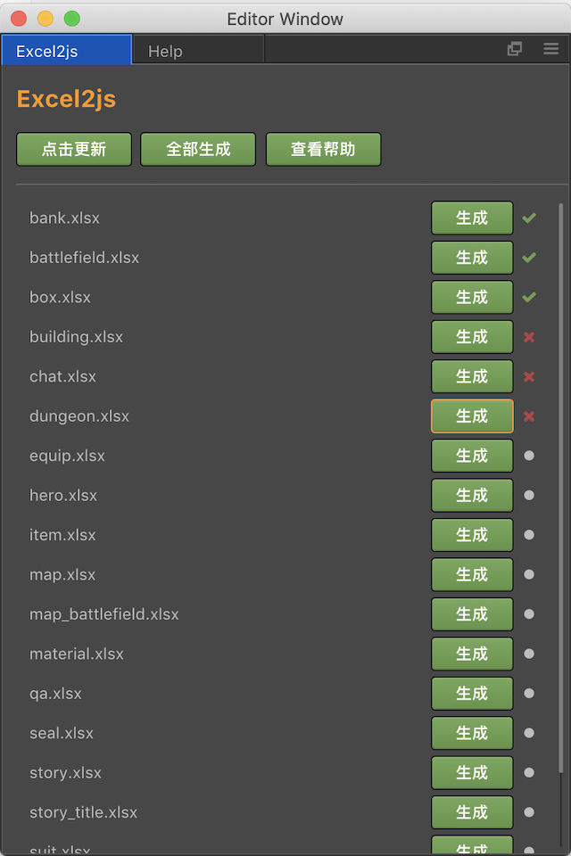
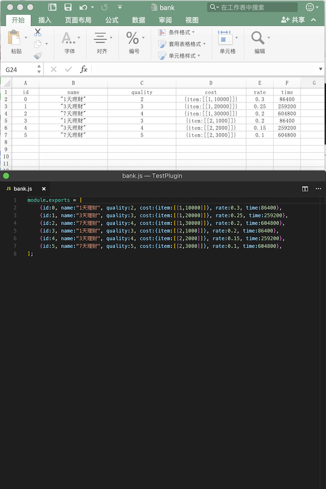

### Cocos Creator 插件：转换 Excel 文件为 js 文件

---

#### 如何使用

参考 [Cocos Creator 插件的安装与分享](https://docs.cocos.com/creator/manual/zh/extension/install-and-share.html)。

#### 注意事项
* excel 的读取路径为 `项目目录/excel/`
* js 文件保存路径为 `项目目录/assets/data/`
* 转换成功后，会以`同名`的 js 文件保存，请自行做好文件备份
* 以`!`开头的 excel 文件会被忽略，以`!`开头的 excel 字段名同样会被忽略
* excel 文件第一行为`字段名`，第二行起为`数据`
* 每个 excel 文件只会解析`第一个`表格
* 支持解析 `.xlsx` 的 excel 文件

#### 转换格式
* excel

| id | name | num | object | array |
| :-----: |:-----:| :-----:| :-----:| :-----:|
| 0 | "名字0" | 0 | {a:1,b:2} | [0,1,2] |
| 1 | "名字1" | 1 | {a:1,b:2} | [0,1,2] |
| 2 | "名字2" | 2 | {a:"对象1",b:"对象1"} | ["数组1","数组2"] |
| 3 | "名字3" | 3 | {a:"对象1",b:"对象1"} | ["数组1","数组2"] |


* js

```javascript
module.exports = [ 
  {id:0, name:"名字0", num:0, object:{a:1,b:2}, array:[0,1,2]}, 
  {id:1, name:"名字1", num:1, object:{a:1,b:2}, array:[0,1,2]}, 
  {id:2, name:"名字2", num:2, object:{a:"对象1",b:"对象1"}, array:["数组1","数组2"]}, 
  {id:3, name:"名字3", num:3, object:{a:"对象1",b:"对象1"}, array:["数组1","数组2"]}, 
];
```

#### 截图

<div>


</div>